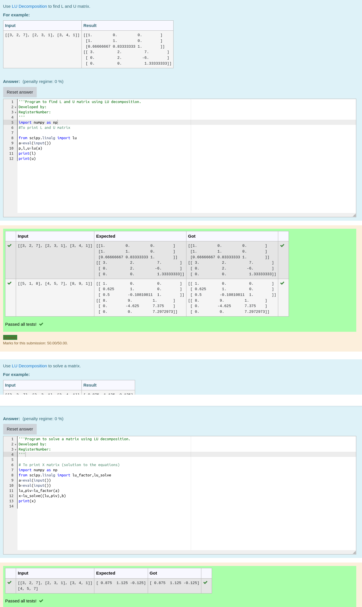

# LU Decomposition 

## AIM:
To write a program to find the LU Decomposition of a matrix.

## Equipments Required:
1. Hardware – PCs
2. Anaconda – Python 3.7 Installation / Moodle-Code Runner

## Algorithm
1. Import numpy library using import statement.
2. From scipy package import lu_factor() and lu_solve().
3. Get two inputs from user and pass it as matrix array.
4. Find lu and pivot value of first marix using lu_factor().
5.Find solution of the matrix by using lu_solve() by passing lu, pivot values as first argument and second matrix as second argument.

## Program:
(i) To find the L and U matrix
```
Program to find L and U matrix using LU decomposition.
import numpy as np
#To print L and U matrix
from scipy.linalg import lu
a=eval(input())
p,l,u=lu(a)
print(l)
print(u)
```
(ii) To find the LU Decomposition of a matrix
```
# To print X matrix (solution to the equations)
import numpy as np
from scipy.linalg import lu_factor,lu_solve
a=eval(input())
b=eval(input())
lu,piv=lu_factor(a)
x=lu_solve((lu,piv),b)
print(x)
```

## Output:



## Result:
Thus the program to find the LU Decomposition of a matrix is written and verified using python programming.

